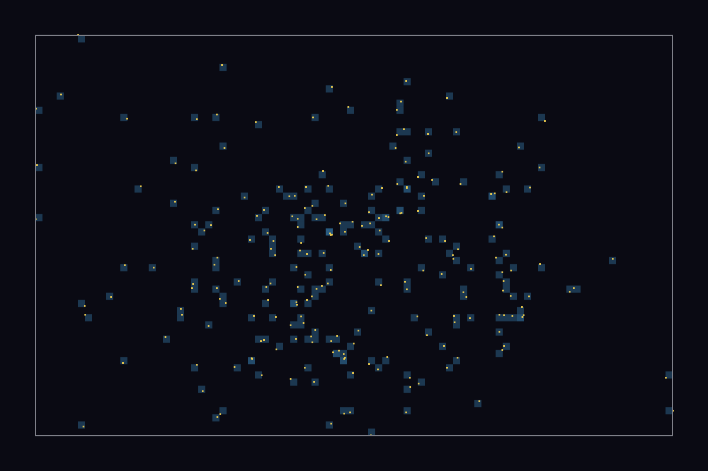

# Ecology

## Purpose

Ecology describes how discovered patterns distribute across parameter and behavior space.

## Terms

- `parameter space`: the coordinate system induced by genotype parameters.
- `niche`: a dense region of parameter-behavior occupancy.
- `habitat`: practical synonym here for a region where similar behaviors persist.
- `edge of chaos`: hypothesis that rich, diverse dynamics cluster near transition regions; this is a framing idea, not yet proven by the current dossier.

## Current Quality-Gated Corpus (2026-02-28)

From the canonical `artifacts/compendium.sqlite` at the shared local artifact root:

- schema version: `4`
- indexed runs: `7`
- total indexed creatures: `224`
- stable creatures: `224`
- unique genotypes: `224` (unique/rows ratio `1.0000`)
- taxonomy-assigned rows: `0` (all taxonomy fields null)

## Interpretation Limits

This quality-gated corpus has strong intra-regime diversity (non-overlapping seed blocks, no genotype duplication), but it is still a single-regime ecology sample (NNEA-style search only).

What this supports well:

- threshold fitting from a clean morphology/ecology population,
- method testing for ecology export and PCA wiring,
- terminology and concept grounding with stable examples.

What this does not yet support:

- multi-habitat niche mapping,
- cross-regime ecological band claims,
- taxonomy-aware ecology (taxonomy is still unassigned in indexing).

## Visual Anchors from This Corpus

Mu-sigma occupancy from the quality-gated corpus (`LeniaCLI ecology --plot`):

In this plot, each point is one indexed creature projected to:

- `mu`: mean kernel center value (`m`) across kernels,
- `sigma`: mean kernel width value (`s`) across kernels.

Slow/meandering exemplar frame:

## Not Implemented

- automated niche labeling and naming,
- taxonomy-aware ecological maps,
- causal tests for "edge of chaos" claims.

## Related Docs

- export command contract: `../contracts/EcologyCLI.md`
- schema contract: `../contracts/CompendiumSchema.md`
- taxonomy concept: `Taxonomy.md`
