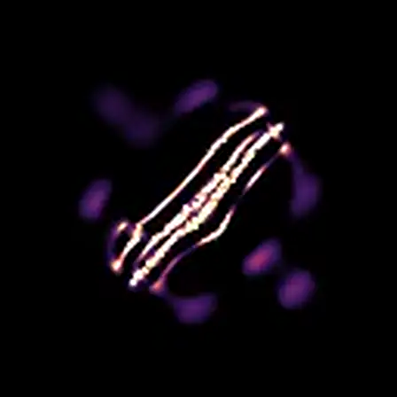

# Morphology

## Purpose

Morphology is the language for describing structure and behavior of discovered patterns.

## Visual Anchors from This Corpus

Near-ballistic translational form:

Low-speed meandering form:

High-tortuosity meander from motile run:

## Terms

- `symmetry`: coarse structural balance (for example bilateral vs radial appearance).
- `segmentation`: visibly repeated substructures.
- `swarm-like`: multiple granular mass clusters moving in coupled ways.
- `trajectory geometry`: how a pattern moves over time (straight, curved, looping, drifting).

Important boundary:

- symmetry/segmentation/swarm are currently descriptive vocabulary,
- trajectory geometry is currently measured and indexed.

## What We Measure Today

The measured morphology surface comes from metrics + morphometrics:

- `pathTortuosity = pathLength / displacement`.
- `movementEfficiency = displacement / pathLength`.

Interpretation:

- low tortuosity + high efficiency => directional transport,
- high tortuosity + low efficiency => meander/loop with limited net displacement.

Anchored examples:

- `crossmap` seed `0`: `path/displacement=1.0026`.
- `nnea` seed `1`: `path/displacement=6.3610`.
- `motile` seed `8`: `path/displacement=22.2946`.

## What Is Still Conceptual

A richer structural morphology index (explicit symmetry classes, segmentation detectors, swarm decomposition) is not yet implemented as first-class indexed fields.

## Related Docs

- exact computed fields: `../contracts/MorphometricsAndTraits.md`
- taxonomy pipeline context: `Taxonomy.md`
- ecology context: `Ecology.md`
