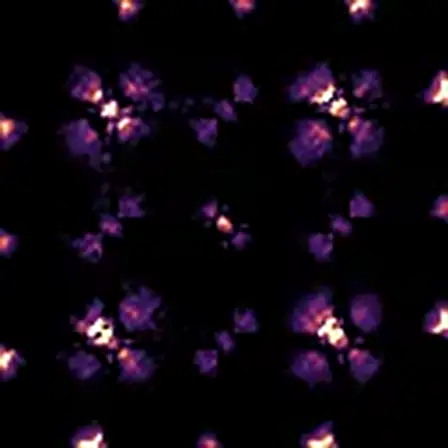
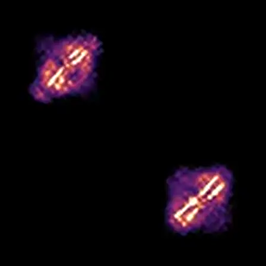

# Taxonomy

## Purpose

Taxonomy is the classification layer for organizing continuous variation into family/genus/species.

## Terms

- `species`: a locally continuous variation class where smooth morphing between members is possible.
- `genus`: nearby species with shared local structural/behavioral organization.
- `family`: broader shared building-block style.
- `continuity`: absence of abrupt phase breaks along small parameter interpolations.

## Current Status in This Dossier

Storage exists, assignment does not:

- taxonomy columns are present in compendium schema,
- current indexed corpus has null taxonomy IDs/method/version for all rows,
- no automatic taxonomy pass is run during indexing yet.

## What We Use Before Full Taxonomy

Pre-taxonomy staging uses measured proxies:

- motion regime (`center_velocity`),
- path geometry (`pathTortuosity`),
- reproducible seed-level exemplars tied to concrete media.

Visual anchors used in this corpus:

## Taxonomy Pipeline

Target protocol:

1. canonicalize genotype (order-invariant kernel representation),
2. cluster into coarse families,
3. refine into genus/species with continuity checks,
4. persist taxonomy IDs with method/version provenance.

## Related Docs

- schema and taxonomy storage fields: `../contracts/CompendiumSchema.md`
- morphology features used for staging: `Morphology.md` and `../contracts/MorphometricsAndTraits.md`
- decision record: `../decisions/ADR-001-taxonomy-status.md`
