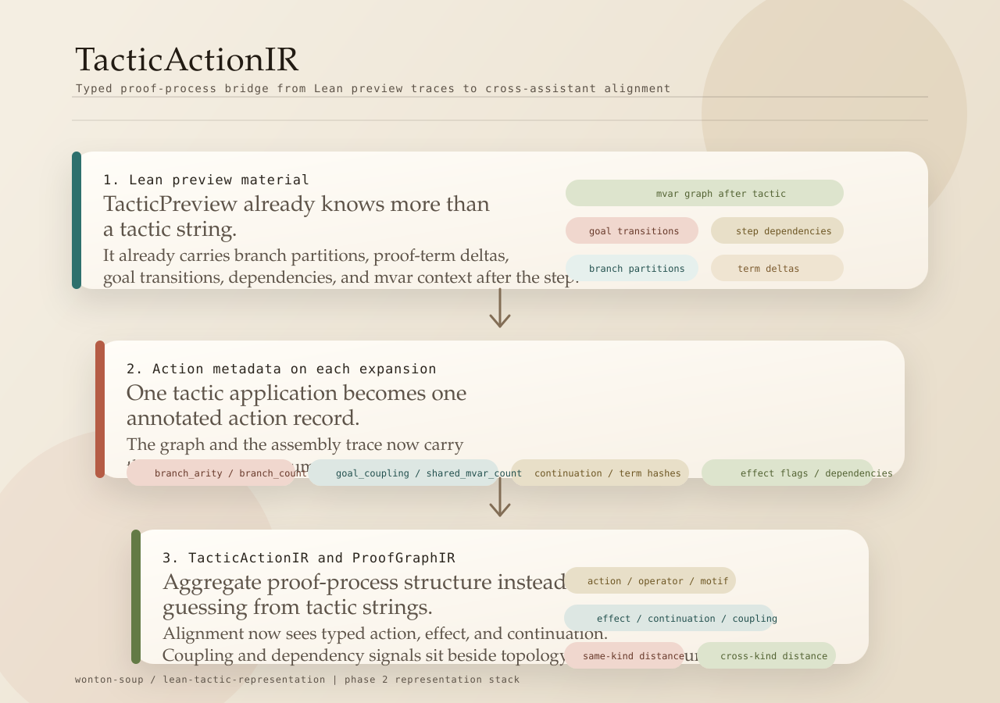
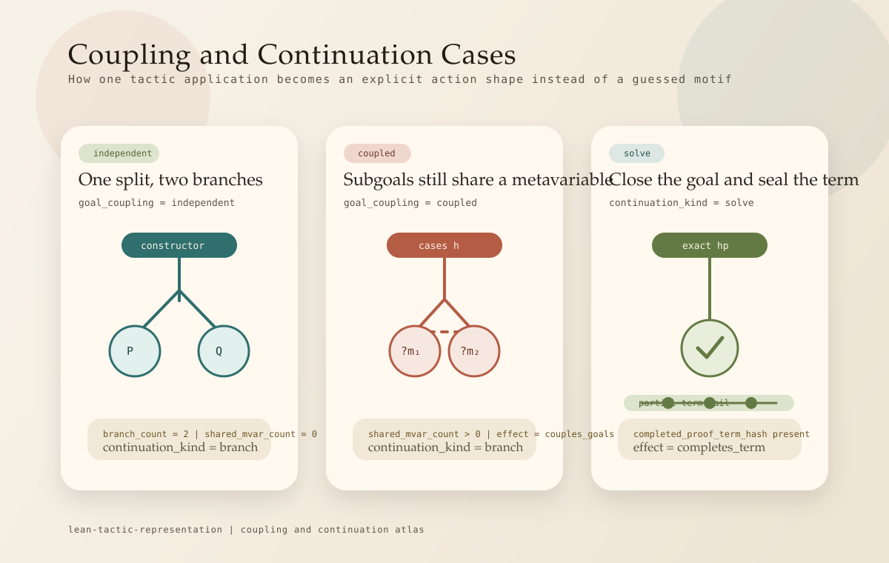

# TacticActionIR

`TacticActionIR` is a `wonton-soup` typed step-summary between raw tactic strings and downstream
proof analysis.



## Why It Exists

`ProofGraphIR` was already normalizing graph families and role profiles, but it still treated tactic
semantics as something inferred from edge labels after the fact. `TacticActionIR` exists so the
search and assembly artifacts retain a typed account of what one proof step did.

## Schema

Each action records:

- `action_kind`: what produced the step (`tactic_step`, `term_constructor`, `proof_rule`, `other`)
- `operator_kind`: assistant-agnostic operator family (`apply`, `bind`, `branch`, `rewrite`, ...)
- `motif_kind`: higher-level structural motif (`motif:bind_open`, `motif:term_apply`, ...)
- `effect_flags`: small explicit effect vocabulary such as `opens_binder`, `branches_goals`,
  `rewrites_target`, `discharges_goal`
- `branch_arity`: how many child goals or structural children the action yields
- `continuation_kind`: `solve`, `chain`, `branch`, `structural`, or `refine`
- `goal_coupling`: `none`, `independent`, `coupled`, or `unknown`
- `tactic_depends_on` / `depends_on_count`: explicit proof-hypothesis dependency summary when the
  producer can expose it
- `proof_step_count`: how many underlying Lean proof-tree steps were summarized into the action

`ProofGraphIR` now derives these action-level aggregate profiles:

- `action_kind_profile`
- `effect_profile`
- `continuation_profile`
- `coupling_profile`

These are intrinsic graph summaries. Run-relative rank features remain outside the IR.

## Stance

- `TacticActionIR` is a producer-side observational contract.
- It is meant to preserve step semantics that would otherwise be lost in tactic strings or bare
  graph edges.
- It does not claim lawful composition, round-trippable execution, or a full tactic language.
- Stronger algebraic or compositional claims belong to the separate research agenda in
  [Lean Tactic Representation](/addenda/#lean-tactic-representation), not to this dossier doc.

## Visual Cases



## Semantics

- Search traces group outgoing edges by expansion order so one tactic application becomes one action,
  not one action per child goal.
- Terminal search steps become explicit `solve` actions via `terminal_tactic`.
- Proof-term DAGs and external proof graphs currently map one edge to one action.
- Goal coupling now uses explicit branch partitioning from Lean preview traces when available.
- Lean step summaries now also expose lightweight proof-tree dependency data
  (`tacticDependsOn`, `spawnedGoals`, `proofStepCount`) without waiting for offline parsing.
- Multi-branch search steps still fall back to `unknown` only when the source trace does not expose
  enough structure.

## Ontology v1

| source role | operator_kind | motif_kind | default effect flags |
| --- | --- | --- | --- |
| `fam:intro` | `bind` | `motif:bind_open` | `opens_binder` |
| `fam:apply` | `apply` | `motif:apply_step` | `instantiates_goal` |
| `fam:split` / `fam:cases` | `branch` | `motif:branch_split` | `branches_goals` |
| `fam:rewrite` / `fam:simplify` | `rewrite` | `motif:rewrite_step` | `rewrites_target`, `normalizes_goal` |
| `fam:closer` / `fam:contradiction` | `close` | `motif:close_goal` | `discharges_goal` |
| `fn` / `arg` | `apply` | `motif:term_apply` | `builds_term` |
| `binder_type` / `body` | `bind` | `motif:term_bind` | `builds_term` |
| `value` | `value` | `motif:term_value` | `builds_term` |

Preview-derived metadata can add explicit flags on top of this table:

- `branches_goals`
- `closes_goals`
- `opens_goals`
- `refines_term`
- `completes_term`
- `couples_goals`
- `splits_independent_goals`
- `spawns_goals`
- `uses_hypotheses`

## Example Search-Trace Action

```json
{
  "tactic": "constructor",
  "edge_role": "fam:split",
  "action_kind": "tactic_step",
  "branch_arity": 2,
  "branch_count": 2,
  "branch_goal_counts": [1, 1],
  "goal_coupling": "independent",
  "shared_mvar_count": 0,
  "tactic_depends_on": ["hp", "hq"],
  "depends_on_count": 2,
  "proof_step_count": 1,
  "continuation_kind": "branch",
  "effect_flags": [
    "branches_goals",
    "closes_goals",
    "opens_goals",
    "splits_independent_goals",
    "uses_hypotheses"
  ]
}
```

## Artifact Boundary

The typed action summary now lands in two places:

- search-graph edge and terminal-node metadata, so search artifacts retain the step structure
- assembly-trace `actionMetadata`, so the same action survives after solution extraction

The shared vocabulary now lives in `dossiers/wonton-soup/prover/tactic_ir.py`, with graph-level
aggregation in `dossiers/wonton-soup/analysis/proof_graph_ir.py`.

## Scoring Contract

These action-layer profiles are now part of graph comparison, not just documentation:

- `action_kind_profile`
- `effect_profile`
- `continuation_profile`
- `coupling_profile`

Same-kind alignment uses them alongside edge-role, operator, motif, and shape channels. Cross-kind
alignment uses them alongside rank-normalized structure so the comparison has a typed proof-process
signal even when raw graph families differ.

## Producer Data Sources

The main upstream sources in the repo are:

- `dossiers/wonton-soup/prover/adapters/lean.py`
  `TacticPreview` carries `branches`, `partial_term_before`, `partial_term_after`,
  `completed_proof_term`, `goals_before`, and `goals_after`.
- `dossiers/wonton-soup/prover/assembly.py`
  `AssemblyStep` records partial-term transitions plus `goals_closed` and `goals_opened`.
- `leantree/leantree/repl_adapter/data.py` in the pinned Specter `leantree` fork
  exposes `spawned_goals`, `mctx_before`, `mctx_after`, and `tactic_depends_on`.

Those artifacts are the right source of truth for replacing heuristic `unknown` coupling and coarse
continuation buckets with explicit proof-process structure.

## Inspection

For theorem-level debugging, use:

```bash
uv run python wonton.py inspect-proof-ir \
  --run-dir <run_dir> \
  --theorem <theorem_name> \
  --graph-source wild_type_graph
```

Add `--compare-theorem` and `--compare-run-dir` to get a direct pair-distance breakdown, or
`--lexical-ablation graph_only` to inspect the graph/action signal without lexical channels.

## Boundary

`TacticActionIR` and `ProofGraphIR` are related, but they are not the same layer. A simple test is:

- if the concept describes one proof step or a family of steps, it belongs here
- if the concept describes how whole graphs are normalized and compared across assistants, it
  belongs with `ProofGraphIR`

The addendum remains the home of the research question about richer tactic representation, but this
step-level representation belongs with the dossier that consumes it.
