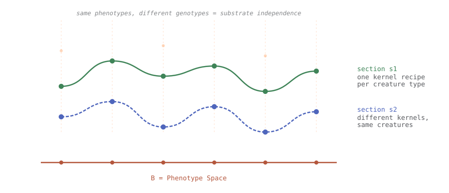
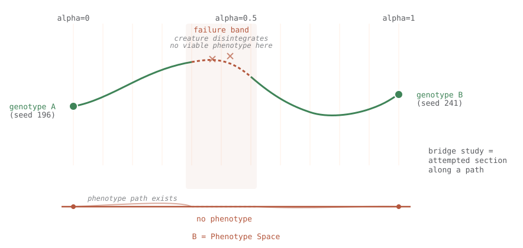
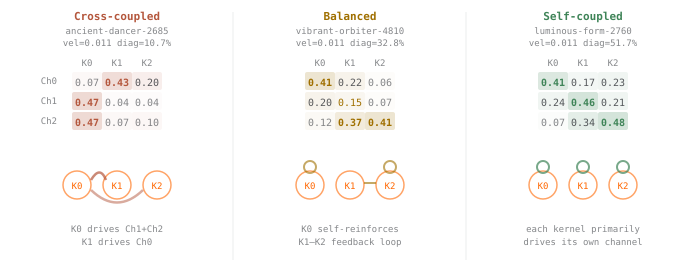
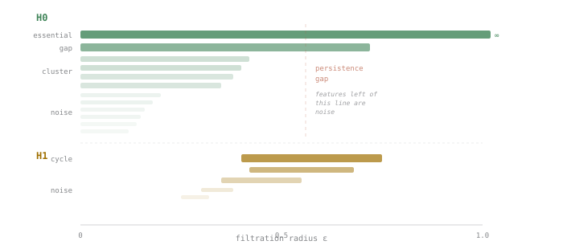
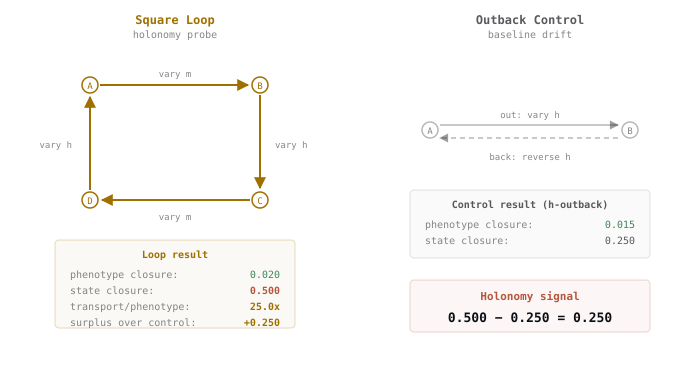
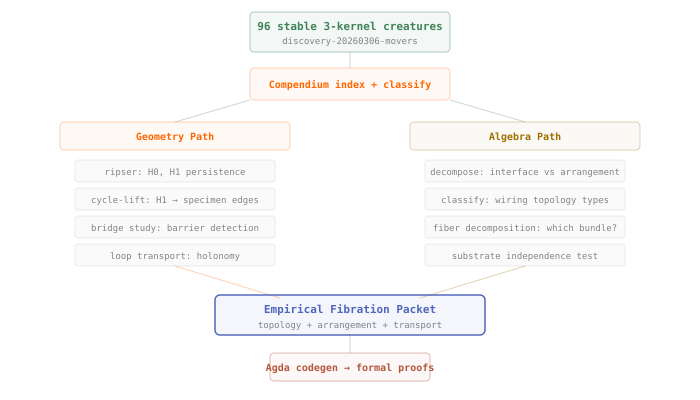

# The Geometry of a Synthetic Morphospace

## 1. 

To flesh out:
- Levin's research, thoughts on morphogenetisc, morphospace
- include planarian, bioelectricity findings
- lack of formalized notions of what morphospace is
- 2023 Grodstein et all, EmbryoMaker paper approaches, cite others
- whatr we're looking for: a space with structure -- distances, paths, barriers, symmetries 

[Morozova and Shubin (2012)](https://arxiv.org/pdf/1205.1158) showed that the morphogenetic field can be formalized as a section of a fiber bundle: the base space contains all cell states across developmental time, the fiber at each cell is the space of possible cell events, and the morphogenetic field selects a specific event for each cell based on its state and position. Development, in this picture, is the minimization of discrepancy between the actual and coded target trees of cell events. "The potential of such a field, if it exists, would correspond to form itself."

This formalization has remained theoretical. The biological morphospace is too high-dimensional, too incompletely understood, and too experimentally constrained for topology or curvature to be computed from data alone.

## 2. What Morphospace Means

The idea that biological forms occupy a structured space goes back to D'Arcy Thompson, who showed in 1917 that the shapes of related species can be connected by smooth coordinate transformations. One fish becomes another fish by stretching the grid.

The modern question is what *generates* that space. There are two approaches. The geometric approach parameterizes morphospace by observable features -- length, width, curvature, symmetry -- and asks how organisms are distributed within it. This tells you what shapes exist but not why those shapes and not others.

The generative approach, advanced recently by [Cano-Fernandez et al. (2025)](https://onlinelibrary.wiley.com/doi/10.1002/jez.b.23279), defines morphospace by what a developmental model can actually produce. Using EmbryoMaker, a general mathematical model of development, they systematically varied cell-level properties (adhesion, contraction, polarization) and enumerated the resulting morphologies. Five transformations dominated: elongation, invagination, evagination, condensation, and anisotropic growth. The reachable forms correlated with real simple animals, early developmental stages, and Ediacaran fossils.

Developmental feasibility acts as a filter on geometric morphospace: not all conceivable shapes are reachable. The accessible region has its own topology—components, holes, ridges—imposed by the dynamics of development rather than the geometry of form.

We aim for the same thing in a synthetic substrate: a generative space where the topology and metric emerge from the dynamics of the system itself. 

## 3. Lenia as Substrate

Flow Lenia generalizes the discrete logic of cellular automata to continuous state, time, and space. Two functions define the dynamics: a kernel $K$ for neighborhood sensing and a growth function $G$ for updates. Every structure—from simple gliders to complex self-organizing "creatures"—is emergent.

For mapping morphospace, Lenia provides three advantages over biological systems:

- **Total Control:** The genotype is explicit. We have a precise parameter vector including kernel radius $R$, inner fractions $r_k$, growth midpoints $m_k$, and the weight matrix $w_{ij}$ coupling kernels to channels.
- **Total Observability:** Every cell state is available at every timestep. There are no hidden variables, unmeasured dimensions, or experimental noise.
- **Tractable Exploration:** Parameter sweeps that would be impossible in embryology run overnight, allowing us to systematically map the space.

  
  
  
  
  
  

The foundation of our analysis is the genotype-to-phenotype map $\pi$, the function that takes a parameter vector, simulates the system, and extracts the resulting morphology.

## 4. The Fiber Bundle Framework

The Morozova-Shubin formalization treats development as a geometric structure called a fiber bundle. We can map Lenia directly into this framework:

- **Base space ($B$):** The phenotype space of observable creature morphologies.
- **Total space ($E$):** The genotype space of all parameter vectors.
- **Projection ($\pi: E \to B$):** The map that simulates a genotype to find its phenotype.
- **Fiber ($F_b$):** The set of all genotypes that produce the same phenotype $b$.

A fiber bundle carries specific internal geometry that reveals how the system can evolve:

**Section.** A map $s: B \to E$ that assigns a genotype to each phenotype continuously. Finding a section is the inverse problem: given a desired morphology, find the parameters that produce it. This is Spivak's "anatomical compiler" in miniature. If a section "tears"—meaning you cannot move smoothly between phenotypes without a jump in parameters—the bundle is non-trivial.

**Connection.** A rule for "parallel transport." If you smoothly deform a phenotype along a path in $B$, how should the genotype follow in $E$? Our bridge studies probe this by linearly interpolating between two creatures. If the intermediate genotypes fail to produce viable creatures, the bundle has a topological obstruction.

**Holonomy.** If you transport a genotype around a closed loop in phenotype space—deforming the creature and then bringing it back to its original shape—does the genotype return to its starting value? If the parameters end up shifted, the bundle is curved. We measured this directly: the phenotype returned with high precision (distance $\sim 5 \times 10^{-5}$), but the genotype shifted by a distance 28x larger.

<figure>

<figcaption>The fiber bundle over Lenia's morphospace. Each phenotype in the base has a fiber of genotypes above it.</figcaption>
</figure>

Multiple sections through the same bundle represent different implementations of the same morphology. This "thickness" of the fiber is a geometric measurement of substrate independence.

<figure>

<figcaption>Multiple sections (s1, s2) show that different parameter choices can produce identical creatures.</figcaption>
</figure>

<figure>

<figcaption>A bridge study between seed 196 and 241. The failure band (red) is a topological barrier where the section tears.</figcaption>
</figure>

## 5. Polynomial Functors and Arrangement

[Spivak (2022)](https://topos.institute/people/david-spivak/Levin20220607.pdf) gives the algebraic counterpart: polynomial functors describe how the creatures are assembled. 

A **polynomial functor** $p = \sum_{i \in P} y^{F[i]}$ encodes an *interface*: $P$ is what the system can output, and $F[i]$ is what it can sense. In Lenia, each kernel is an interface. A kernel with narrow steepness ($s = 0.058$) has a specific, limited sensorium, while a broad one ($s = 0.173$) responds to a wider range of neighbor densities.

The weight matrix $w_{ij}$ is the **arrangement**: the wiring diagram that specifies how these kernel interfaces are coupled. This gives us a useful decomposition of the Lenia genotype:

1.  **Interface parameters:** Per-kernel $r, m, s, h$ (the individual "sensors").
2.  **Arrangement parameters:** The weight matrix $w$ (the "wiring").

This distinction allows us to diagnose failures in our bridge studies. We can ask: did the interpolation fail because the sensors themselves became non-functional (interface obstruction) or because the way they were wired together became incoherent (arrangement obstruction)?

<figure>

<figcaption>Three creatures with nearly identical phenotypes but distinct arrangements: cross-coupled, balanced, and self-coupled.</figcaption>
</figure>

## 6. Topology: Persistent Homology

To understand the global structure of morphospace, we used **persistent homology** on the pairwise distances of genotypes in a 96-creature cohort. This technique identifies topological features that "persist" across different scales, distinguishing real structure from noise.

- **$H_0$ (Connected Components):** We found two primary components that are topologically separated across a wide range of parameters: the "drifter-triplet" family and the "eddy-triplet" family. These are distinct "islands" in morphospace.
- **$H_1$ (Cycles):** We detected non-contractible loops—closed paths through morphospace that cannot be shrunk to a point because they enclose a region of non-viability. 

The cycle-lift pipeline maps these abstract cycles back to concrete specimen pairs, allowing us to test if moving along these loops causes the "parameter drift" characteristic of a curved bundle.

<figure>

<figcaption>Persistence barcodes. The H0 gap and H1 cycle represent genuine topological features of the space.</figcaption>
</figure>

## 7. Transport and Holonomy

We measured holonomy using a square loop in parameter space, varying the growth midpoint $m$ and height $h$. We compared this against an "outback" control that traverses a single axis and returns.

Both the loop and the control return to the starting phenotype. However, the loop produced an endpoint state closure of 0.500, while the control produced only 0.250. This 0.250 surplus is the "holonomy signal"—it represents the curvature of the bundle integrated over the area of the loop.

Concretely: if you transport *serene-dancer* through a loop of other phenotypes and back, it returns to the same shape, but its internal parameters have drifted (e.g., radius $R$ shifted from 10.57 to 10.61). The form is the same, but the implementation has changed.

<figure>

<figcaption>Holonomy experiment. The 0.250 surplus in state closure indicates the curvature of the morphospace bundle.</figcaption>
</figure>

## 8. Measuring Substrate Independence

The evidence for fiber-bundle structure is the existence of "thick" fibers: different genotypes yielding the same phenotype. We compared *crystal-walker* and *mystic-pattern*, which have nearly identical velocities and spatial extents.

| Metric | crystal-walker | mystic-pattern |
|---|---|---|
| Velocity | 0.0101 | 0.0101 |
| Arrangement | Cross-coupled | Balanced |

The phenotype distance between them is small (**0.218**), but their interface distance is 5x larger (**1.106**). They are two fundamentally different internal architectures achieving the same morphological goal—a direct measurement of substrate independence.

## 9. Implications for Diverse Intelligence

These tools map onto questions from [Michael Levin](https://www.drmichaellevin.org/)'s research program:

1.  **Attractor Discreteness:** Levin's experiments suggest organisms settle into discrete target morphologies. If our $H_0$ components persist across different Lenia "physics" (different rules), it suggests this discreteness is a topological property of morphospace itself.
2.  **Navigation Hierarchy:** With a metric for morphospace, we can define geodesics (optimal paths) and compare "greedy" navigators against "topology-aware" ones. This makes Levin's competency hierarchy geometrically precise.
3.  **Anatomical Compilers:** Target morphology encoding becomes a section-finding problem. The Poly decomposition breaks this into identifying a viable arrangement class, then optimizing interfaces within it.
4.  **Substrate Independence:** Quantified by the thickness of the fibers.

Recent work by [Plum and Serra (2025)](https://www.biorxiv.org/content/10.1101/2025.01.04.631293v1) on "embryological light cones" fits here: their strain tensors modulate the bundle connection, bounding the region where holonomy can accumulate.

## 10. Next Steps

- **Physics Invariance:** We are testing if $H_0/H_1$ structures persist across different Lenia rule families to see if the topology is an invariant of the morphospace.
- **Agda Formalization:** We are building a path to Agda to turn these observations into verified theorems.
- **The Inverse Problem:** Using the Poly decomposition to find sections for arbitrary target phenotypes—building the first "anatomical compiler" for Lenia.

Lenia is a proxy. The goal is to refine these geometric and algebraic tools so they can be applied to the higher-dimensional, noisier morphospace of real developmental biology.

<figure>

<figcaption>The full pipeline: from simulation to topological persistence to formal verification.</figcaption>
</figure>

---

*This article reports on work from the [lenia-swarm](/dossiers/lenia-swarm/) dossier (D-003). The interactive visualization pages are available in the [fiber theory collection](/dossiers/lenia-swarm/generated/fiber-theory-specter/). The topology and transport infrastructure lives in the lenia-fiber-geometry workspace.*
