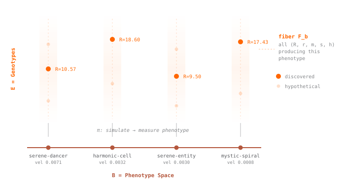

# The Geometry of a Synthetic Morphospace

Two frog embryos can carry the same genes and grow into the same shape and still be headed for different bodies, because part of what steers a tissue toward its final form is internal state you cannot read off the shape, things like the bioelectric voltage patterns Michael Levin's lab can rewrite to make a planarian regenerate the wrong head ([Beane et al. 2013](https://pubmed.ncbi.nlm.nih.gov/23250205/)). The question underneath is how much of an organism's fate its visible form actually fixes and how much rides on a hidden layer the form never shows, and you cannot run that experiment on a frog, since asking it means getting hold of the full rulebook that turns an internal state into a morphology and then checking whether two forms that look identical to the eye carry the same state underneath, and for a frog no one has the rulebook.

In Flow Lenia you do have the rulebook. Lenia starts from the same setup as Conway's Game of Life, a grid of cells updated by a fixed local rule, and relaxes it so cells hold any value between off and on, time advances in small smooth steps, and each cell feels its neighbors through a soft kernel rather than a hard 3x3 box, and out of that arithmetic stable blobs appear that glide across the grid, hold their shape while they move, and pull themselves back together after you disturb them, looking far closer to swimming microorganisms than to the blocky gliders of the original Life ([Chan 2019](https://arxiv.org/abs/1812.05433)). Flow Lenia adds one constraint on top, mass has to be conserved so matter flows through the field instead of appearing and vanishing, and the persistent structures stop behaving like growth waves and start behaving like moving bodies. None of it is alive, but all of it is exposed, since every cell at every step is inspectable and every rerun under a changed parameter is cheap, so the rule that produced any given creature is sitting right there to read, which is the property the whole report leans on.

A morphospace is a map of possible forms laid out so similar shapes sit close together, the way biologists have charted fish bodies, leaf outlines, and skull shapes to see which forms nature actually uses and which it leaves empty, and in Levin's framing living systems move through such a space as agents rather than running a fixed construction script, with the [cognitive-light-cone framing of TAME](https://arxiv.org/abs/2201.10346) raising the agency questions that sit alongside this in our [research-program overview](../research-program-overview/). Charting a morphospace from the outside tells you where the forms are, it does not tell you what would have to change at the rule level to move from a form to its neighbor, since for a fish or an embryo you only ever see the shapes that got built and never the rules that built them. Two papers gave us the vocabulary for working from the inside: [Morozova and Shubin](https://arxiv.org/abs/1205.1158) describe a morphogenetic field as a structure built over a space of cell states, with the events possible at each point living in the fiber over it, which maps onto Flow Lenia almost directly since our rule parameterizations sit in the fiber over a measured form, and [Cano-Fernandez et al.](https://pmc.ncbi.nlm.nih.gov/articles/PMC11788879/) come at it from the generative side with EmbryoMaker, asking which morphologies are actually reachable from simple changes to cell properties. We carry that reachability question into Flow Lenia and then drop EmbryoMaker morphology snapshots and Dryad fish body outlines into the same coordinates, so a synthetic cellular automaton, a developmental model, and a set of real fish all sit in one shared space measured by the same twelve descriptors, and we get to see whether either paper's vocabulary survives transplant into a fully controllable substrate.

With all three clouds in one space, the question we keep returning to is the embryo question in synthetic form: take a creature, walk its shape around a closed loop by nudging it through a sequence of forms that ends exactly where it began, and ask whether the rule that generates it comes back too, or whether the rulebook holds a memory of the trip that the shape has thrown away. You cannot walk that loop on an embryo or a fish, since no one has their generating rules, while in Flow Lenia we can walk it and read the residue straight off the parameters. Around it sit the more ordinary comparisons, how close the Lenia cloud sits to the EmbryoMaker snapshots and the fish outlines under a real metric, and where the Lenia cloud has genuine holes in it. None of this proves anything about embryos or fish on its own, it gives us numbers we can permute and check, which is what we wanted out of the substrate in the first place.

## The Map

At the center is the genotype-to-phenotype map $\pi$.

- **Genotype:** the Flow Lenia rule parameters (channels, kernels, growth functions, channel coupling weights, etc.).
- **Phenotype:** the measured morphology and motion of a specimen (extent, elongation, compactness, symmetry, components, transport, etc.).
- **Projection $\pi$:** run the simulation, then measure the terminal or trajectory-level phenotype.
- **Fiber over a phenotype:** the set of genotypes that land near the same measured morphology.

Three things over the fiber are worth naming:

- **Section:** given a target phenotype, find a genotype that produces it when you run the simulation. The inverse-design problem.
- **Connection:** for a small intended change to the phenotype, the genotype adjustment that delivers it, found by running the simulation forward and checking.
- **Holonomy:** pick a small sequence of target phenotypes that starts and ends at the same point. For each step, find the genotype adjustment that lands on the next target. After completing the sequence, compare the final genotype to the starting one. If they differ, the phenotype loop did not close in genotype space.

Holonomy is the one we actually run in this report. The other two come up later. We want holonomy because it tells us whether the descriptor we used to define the loop is hiding a degree of freedom at the rule level.

<figure class="morphospace-figure wide">

<figcaption>Flow Lenia has a concrete genotype-to-phenotype map. The fiber over a phenotype is the set of parameterizations that produce similar measured forms.</figcaption>
</figure>

## The Corpus

The May 19 common-morphology comparison ran over four cohorts:

| Cohort | Count | Role |
|---|---:|---|
| Flow Lenia, broad comparison cohort | 25,167 | full synthetic morphospace spanning multiple rule families |
| Flow Lenia, single rule-family slice | 8,192 | clean internal control, small enough for exact persistent homology |
| [EmbryoMaker morphology snapshots](https://github.com/HugoCanoFernandez/Morphospace_exploration_EMaker) | 859 | developmental morphospace comparison |
| [Dryad fish body outlines](https://datadryad.org/dataset/doi:10.5061/dryad.n2z34tn2t) | 232 | biological shape comparison |

Every specimen carries the same 12 normalized morphology descriptors, and the distance and topology pipelines run identically across the three clouds. The comparison is no longer just a gallery, since the same metric and the same persistence computation give comparable numbers across Lenia, EmbryoMaker, and the fish.

## Loop Structure

The question we want to ask each cloud is simple. Pick a specimen, walk to a nearby specimen, walk to a nearby specimen, and keep going. Can you ever come back to where you started without retracing your steps? If yes, there is a closed loop in the cloud. Now widen what counts as nearby. Does the loop survive, or does it merge with the rest of the cloud as you zoom out? A loop that survives heavy widening marks a real gap in the cloud, a ring of forms the system keeps producing around some shape it never actually settles into, a hole in the space of forms rather than a smudge in it. A loop that vanishes at the first widening was noise. Persistent homology counts these loops across every widening at once, and the number that matters per loop is its persistence: how much widening it survives before merging away.

All three clouds contain closed loops, with the same pipeline finding 297 in the [EmbryoMaker morphology snapshots](https://github.com/HugoCanoFernandez/Morphospace_exploration_EMaker) and 66 in the [Dryad fish outlines](https://datadryad.org/dataset/doi:10.5061/dryad.n2z34tn2t), so the presence of loop structure is not a Lenia artifact. What separates the substrates is how long the loops hold up under widening: the longest Lenia loop stays visible across roughly four times the widening of the longest fish loop and almost ten times the longest in EmbryoMaker (top $H_1$ persistence 2.78, against 0.64 and 0.29). That headroom is what lets us walk along a Lenia loop and watch what the rule layer is doing without the descriptor signal washing out by the second step.

The Lenia number is not inflated by sample size or by mixing rule families. The no-food 8,192 cohort, a single rule family small enough for exact dense TDA on the same descriptors, tops out at persistence 0.80, still comfortably above either biological cohort, and the broad Lenia cloud goes higher only because it spans rule families the no-food slice never visits.

<figure class="morphospace-figure wide">

<figcaption>Each bar tracks one feature in the morphology cloud (a connected component or a loop) across distance scales. Long bars are features that survive as you zoom out; short bars vanish almost immediately.</figcaption>
</figure>

## Biological Distance

Two questions. How close does the broad Lenia cloud sit to the [EmbryoMaker morphology snapshots](https://github.com/HugoCanoFernandez/Morphospace_exploration_EMaker) and to the [Dryad fish outlines](https://datadryad.org/dataset/doi:10.5061/dryad.n2z34tn2t)? And is that closeness uniform across the 25,167 Lenia specimens, or are there pockets that lean one direction more than others?

Flow Lenia is a rule family wide enough that, with enough sampling, you can find specimens that resemble almost any morphology you choose to measure against, which means "some Lenia specimens look like fish" is not on its own an interesting claim. The question with stakes is whether biological resemblance lines up with anything else, whether a region of the Lenia cloud picked out by the cloud's own internal geometry, without any biological data in the loop, happens to be the region that leans biological.

On average, the distances are unsurprising. The typical EmbryoMaker snapshot has a Lenia neighbor within about two units of normalized descriptor distance (median 1.91), and the typical fish outline within about three and a half (median 3.39). Read from the other side the medians are larger (4.46 to EmbryoMaker, 5.90 to fish), simply because the few hundred biological specimens are scattered through a synthetic cloud of 25,167 and most of that cloud is nowhere near any of them. Taken as a whole, Lenia ends up looking more cell-aggregate-shaped than fish-shaped, which is what we expected from the rule families we sampled.

One 256-specimen patch in the Lenia cloud, defined as a single $H_1$ neighborhood in the cloud's own descriptor geometry and identified without reference to the biological data, runs the global pattern in reverse. Inside the patch, the median Lenia-to-fish distance is roughly half what it is across the broader cloud (3.30 versus 5.90), and the median Lenia-to-EmbryoMaker distance is almost three times larger (11.98 versus 4.46). A composite bridge score (Lenia-to-fish distance minus Lenia-to-EmbryoMaker distance, so negative means closer to fish than to embryos) swings from a global mean of $+0.6$ to a local mean of $-8.2$ across the patch, which is a sign flip across all 256 specimens rather than a drift in a handful of outliers, and the chance of a random 256-specimen patch reproducing that fish-tilt is roughly one in a thousand under permutation. The top transport witnesses inside the patch replay as elongated, directional, streak-shaped creatures rather than the radially symmetric blobs that dominate the rest of the cloud:

<figure class="morphospace-figure wide">
<iframe src="../../assets/blog/lenia-morphospace-report/fig-fish-near-witnesses.html?v=fish-near-20260524" title="Six specimens from the 256-member fish-near patch, replayed as autoplaying loops." style="width: 100%; height: 760px; border: 1px solid rgba(11,14,20,0.10); background: #ffffff;" loading="lazy"></iframe>
</figure>

What makes this more than a curation artifact is what the same patch does on a measurement that has nothing to do with biology. The 32 matched transport groups inside it leave about five times as much rule-residue around a closed phenotype loop as the global average, with a stratified permutation putting the chance of a random patch producing that residue level at roughly one in two thousand. Two independently constructed measurements (descriptor distance from Lenia to the two biological cohorts, and rule-parameter closure around a loop) pick out the same 256 specimens, and since neither measurement uses the other's data, the convergence is not something either pipeline could have engineered toward biology on its own.

## Transport Residue

flow-map-elite-38-4984EC16 walks a closed loop in phenotype space. It returns to within $7.7 \times 10^{-5}$ of where it started, which is a sub-millipercent drift in the descriptor space we use to compare specimens. Across that same loop, its rule parameters do not return. The matched control is an axis-retrace: the same walk played out and then back along its own path, which should close exactly. Against that baseline the closed loop leaves about 2.8% more mass residue on average, and at its widest scale its closure ratio runs 150% of the retrace control's. The descriptor came back. The rule did not.

The question worth asking is whether the descriptor is faithful. If two specimens land at the same point in descriptor space, are they the same specimen, or can they have room to differ in the rule layer that the descriptor is not measuring? Loop transport tests this directly. Walk a closed loop in descriptor space, end where you started, and check whether the rule returned too. flow-map-elite-38 is the broad-cohort case where it did not. The residue is the size of what the descriptor is dropping. That matters because the morphospace work we are pulling from (EmbryoMaker, the Dryad fish outlines) takes the shape descriptor as the comparison object by construction. Two specimens that sit on top of each other in descriptor space are assumed to behave the same, and when the rule has slack the descriptor does not see, that assumption is wrong.

At the cohort level this is a tail effect, not a population effect. Of 4,802 flow-supported transport groups, 109 (about 2.3 percent) pass a strict positive-surplus criterion at small, medium, and wide rectangle scales for both state closure and ratio. Under scale permutation, the joint state-and-ratio criterion is marginal (p around 0.094); the single-metric tails are clear (p around 0.0002 for ratio only, 0.008 for state only). In the broad top-five dense rerun, flow-map-elite-38 above was the only specimen that survived both joint controls. In the fish-near localized dense rerun, none of the five checked groups survived both, though one survived by state only and one by ratio only.

So far this is cohort-level. The broad corpus carries a real transport tail, the localized topology picks out neighborhoods enriched for state residue, and one specimen survives tight joint controls in the broader rerun. The next move is per-specimen evidence across more of the corpus.

<figure class="morphospace-figure wide">

<figcaption>A closed loop in phenotype space, walked step by step in parameter space. If the parameter state does not return to where it started, the gap is the transport residue we want to measure.</figcaption>
</figure>

## Two Tracks

Two strands of work run alongside each other in this dossier. Creature discovery is the side where MAP-Elites, QD, paper presets, and seed libraries come in, with the goal of Flow Lenia organisms that look alive when you watch them and hold together while they move, and what that side wants is pretty specimens and a growing library of them. The synthetic morphospace itself is the other side, where we sweep one Lenia rule family with the genotype-to-phenotype relation kept explicit, look at whatever geometric structure shows up (loops, fibers, transport residue, anything we can put numbers on), and put the resulting Lenia cloud next to other morphogenetic spaces, starting with [EmbryoMaker morphology snapshots](https://github.com/HugoCanoFernandez/Morphospace_exploration_EMaker) and [Dryad fish body outlines](https://datadryad.org/dataset/doi:10.5061/dryad.n2z34tn2t) and growing from there, and what that side wants is coverage and provenance instead of beauty.

The broader bet driving the next phase is that the geometric pieces of a morphospace, things like loops, fibers, and transport residue, are real enough to recur across morphology cohorts that share nothing else, with Flow Lenia as the controllable case where we can actually compute them and EmbryoMaker tissues and Dryad fish outlines as the two external cohorts we have so far. That list needs to grow well past two before the recurrence question has any traction, since substrate recurrence is the only test we know that separates real structure from a metaphor we got attached to, and at the rate of two biological cohorts it is not a test yet.

The other open question is what the rule-layer residue actually corresponds to in living tissue, and it looks like the kind of hidden state Levin's program already names there, things like bioelectric voltage and transmembrane signaling that steer a morphology decision the form descriptor cannot see. If that reading holds, Flow Lenia is giving us the rule-layer view of a phenomenon we currently only have the morphology-layer view of in biology.

---

This article reports on work from the [Lenia Swarm](/dossiers/lenia-swarm/) dossier (D-003). The numbers above come from the May 19, 2026 common-morphology and localized-loop analysis packet, plus the May 21, 2026 interface/arrangement pilot.
