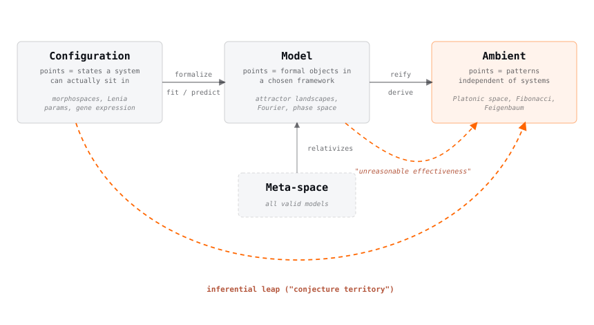

# On The Point Of It All

We keep running into systems where the visible result does not tell the whole story. A planarian can be pushed toward the wrong anatomy by changing bioelectric state ([Beane et al. 2013](https://doi.org/10.1242/dev.092015)); a proof search can reach the same theorem through different tactic routes; a Flow Lenia creature can return to almost the same measured shape while its rule parameters fail to close. In each case, the tempting question is whether we are seeing one kind of structure through several very different machines.

[Levin's group](https://drmichaellevin.org/) is the empirical reason we care. Bioelectric state decides whether a planarian fragment grows a head or a tail, and voltage perturbations can induce ectopic eyes in Xenopus that connect to useful sensory behavior ([Pai et al. 2012](https://doi.org/10.1242/dev.073759), [Blackiston and Levin 2013](https://doi.org/10.1242/jeb.074963)). Xenobots and Anthrobots show cells assembling into bodies they were never selected to make. These results do not need a grand reading to be strange: a cell-by-cell parts list is plainly not the whole explanatory picture.

The expensive part is making the relevant spaces concrete. We want systems where we can inspect state, change one thing, rerun, and keep the provenance. A damage response, basin boundary, or geometric feature that recurs across substrates is a better starting point than a resemblance noticed after the fact.

## On "Platonic space", and why morphospace comes first

A morphospace is the local version of this: possible states or forms for one system, together with the dynamics that make some regions easy to reach and others inaccessible. We start there because it is computable. For planarian regeneration, Lenia, and proof search, the useful maps barely exist; there is nothing serious to compare until we build them.

The larger reading is structural realism held tightly. A feature that survives a change of representation, scale, and intervention may name something real about the system; a feature that survives across substrates sharing neither material nor encoding demands a different explanation. “Platonic space” names that stronger possibility, not every recurrent pattern.

## The probe worlds

We use small worlds because each one lets us break something cleanly.

### Wonton Soup

[Wonton Soup](../../research-notes/wonton-soup-follow-up/) blocks tactics in Lean proof search and watches whether the solver reroutes or collapses. Different provers can reach the same theorem by visibly different trees, so we can ask what actually survives the lesion: a tactic role, a proof family, or merely the terminal theorem.

### Lenia

[Lenia](../lenia-morphospace-report/) is a synthetic world whose full state and rules are inspectable. We run thousands of variants, define a metric, and compare its geometric features and biologically-near regions across rule families and external morphology cohorts.

### Material memory

[Material memory](../../research-notes/material-memory-without-a-controller/) is a vibrating rigid-body assembly with local, history-dependent updates and no controller. It retains a trace after a pulse, then carries that trace into damage recovery. The experiment separates persistence from flexible remapping.

### Categorical morphogenesis

[Where tissues break](../../research-notes/where-tissues-break/) turns a closed-loop Turing tissue into a wiring diagram and cuts it. The worst cut is not the one that severs most edges; it is the one that leaves a fragment too small to sustain its pattern, and that location shifts abruptly with diffusion.

Across all of these, we are looking for damage responses that recur without being forced into the same representation. (See also [structural realism](../../research-notes/from-structural-realism-to-platonic-space/).)

## The tools

Polynomial functors and persistent homology are doing real work in the current experiments. We also use lenses and fibrations where they make an interface or a level of description explicit, but we are not collecting category-theory nouns for their own sake. The test is simple: does the formalism tell us what to perturb, what state to measure, or what would count as the same structure after a change of representation?

## Kinds of spaces

<figure class="morphospace-figure wide">

</figure>

“Space” gets used for three different things here. A configuration space holds states a system can actually occupy; a model space holds the formal objects we use to describe it; an ambient space would hold a pattern independently of any particular realization. A Lenia parameter setting and a planarian voltage pattern belong to the first. An attractor landscape belongs to the second. The Fibonacci arrangement or a Game-of-Life glider are the intuitive cases for the third.

Going from a system to a model is ordinary science. Going from repeated model results to an ambient pattern is the dangerous step. Convergence alone says little: a ball in a bowl converges. The pattern needs a description simpler than the system ([Aaronson 2011](https://arxiv.org/abs/1108.1791)), survival under intervention, and recurrence where neither implementation nor measurement has been shared.

So we map reachable regions, find the boundaries of stable forms, and identify perturbations that change the route without destroying the outcome. Repetition after that is a claim with teeth.

## References

- [Aaronson (2011)](https://arxiv.org/abs/1108.1791). "Why Philosophers Should Care About Computational Complexity."
- [Beane et al. (2013)](https://doi.org/10.1242/dev.092015). "Bioelectric signaling regulates head and organ size during planarian regeneration." *Development*.
- [Bongard and Levin (2023)](https://arxiv.org/abs/2212.10675). "There's Plenty of Room Right Here: Biological Systems as Evolved, Overloaded, Multi-scale Machines."
- [Blackiston and Levin (2013)](https://doi.org/10.1242/jeb.074963). "Ectopic eyes outside the head in Xenopus tadpoles provide sensory data for light-mediated learning." *Journal of Experimental Biology*.
- [Chis-Ciure and Levin (2025)](https://doi.org/10.1007/s11229-025-05319-6). "Cognition all the way down 2.0." *Synthese*.
- [Gumuskaya et al. (2023)](https://doi.org/10.1002/advs.202303575). "Motile Living Biobots Self-Construct from Adult Human Somatic Progenitor Seed Cells." *Advanced Science*.
- [Kriegman et al. (2020)](https://doi.org/10.1073/pnas.1910837117). "A scalable pipeline for designing reconfigurable organisms." *PNAS*.
- Ladyman and Ross (2007). *Every Thing Must Go: Metaphysics Naturalized*. Oxford University Press.
- [Levin (2022)](https://arxiv.org/abs/2201.10346). "Technological Approach to Mind Everywhere." *Frontiers in Systems Neuroscience*.
- [Niu and Spivak (2023)](https://arxiv.org/abs/2312.00990). "Polynomial Functors: A Mathematical Theory of Interaction."
- [Pai et al. (2012)](https://doi.org/10.1242/dev.073759). "Transmembrane voltage potential controls embryonic eye patterning in Xenopus laevis." *Development*.
- [Spivak (2019)](https://arxiv.org/abs/1908.02202). "Generalized Lens Categories via functors C^op to Cat."
- [Spivak (2022)](https://topos.institute/people/david-spivak/Levin20220607.pdf). "Polynomial Functors: Interaction in a General Categorical Framework."
