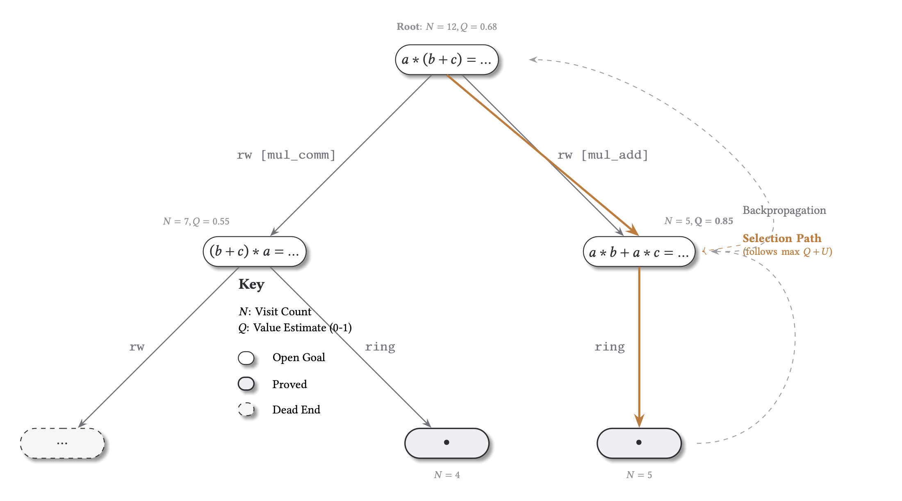
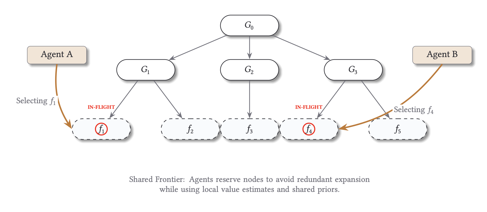
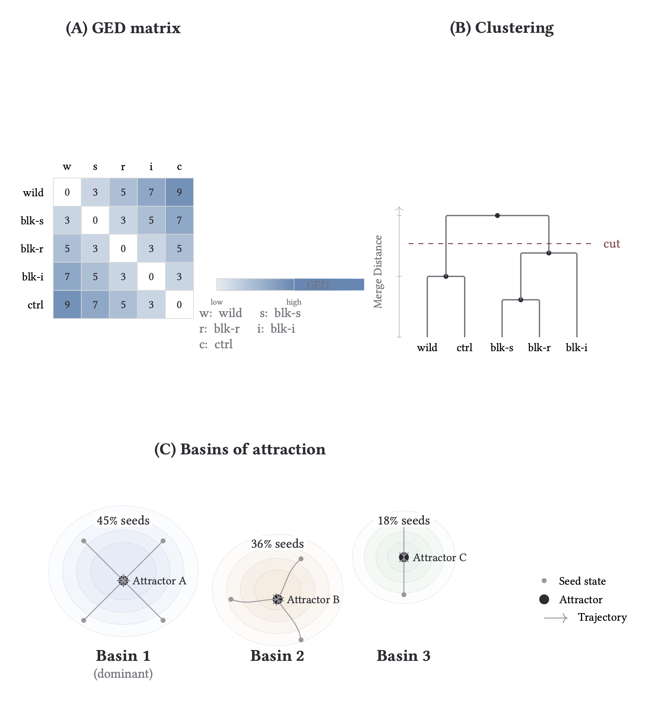
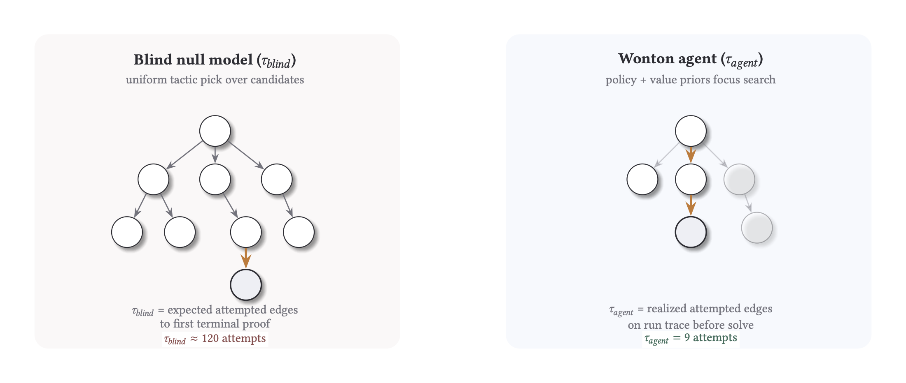
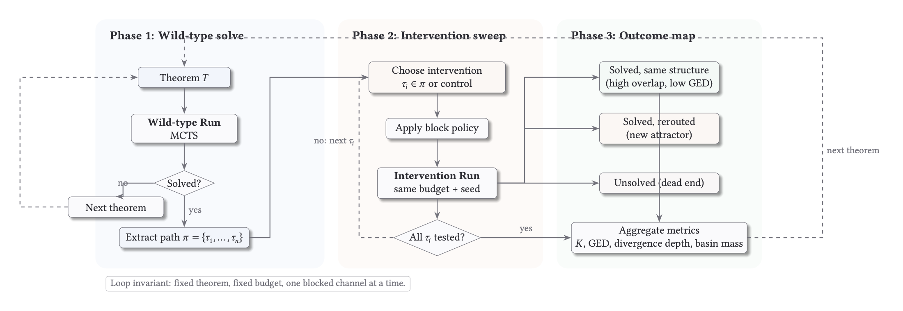

# Wonton Soup: Proof Structures Under Interventions

`wonton-soup` is our intervention harness for proof-search experiments. The question:

when we perturb a solver's search process, does it return to the same proof structure, or settle into a different one?

We run wild-type and intervention sweeps over deterministic theorem samples, capture full search artifacts (`*_history.json`, `*_mcts_tree.json`, `*_graph.json`, `*_comparison.json`), and compare outcomes across seeds, tactics, providers, and backends.

## 1. What We're Looking For

We treat proof search as a stochastic process over structured states.

- A perturbation can be a blocked tactic or tactic family, a seed change, or a policy/scheduler change.
- A response can be recovery to the same structural family or migration into a different attractor.
- The object of study is not only solve rate; it is the shape and stability of search trajectories.

This is why we log enough structure to replay and compare runs months later under fixed configuration.

## 2. Theoretical Mapping

Our intervention protocol applies three specific concepts from the [Diverse Intelligence](https://www.diverseintelligence.org/) research program to formal proof search.

### Search efficiency as a metric ($K$)
Following [Chis-Ciure and Levin (2025)](https://link.springer.com/article/10.1007/s11229-025-05319-6), we treat intelligence as search efficiency in problem spaces. We measure the log-ratio between a random walk ($\tau_{blind}$) and our observed agent ($\tau_{agent}$):
$$K = \log_{10}(\tau_{blind} / \tau_{agent})$$
A positive $K$ quantifies how many orders of magnitude our policy saves over a brute-force baseline.

### Lesions and Rerouting
[Zhang et al. (2024)](https://arxiv.org/abs/2401.05375) demonstrate that decentralized systems (like self-sorting arrays) can navigate around "damaged" components to reach a global goal. We replicate this by blocking specific tactics or lemma families from a known solution path. We measure whether the solver reroutes to a new attractor or collapses, quantifying the "competency" of the search process.

### Pattern Invariance (TAME)
The TAME framework ([Levin, 2022](https://arxiv.org/abs/2201.10346)) argues that behavioral structures—not just low-level mechanisms—persist under perturbation. In `wonton-soup`, we use Graph Edit Distance (GED) and basin analysis to determine if proof search trajectories settle into stable, recurrent families (attractors) across different seeds and interventions.

## 3. Harness and Corpus Design

Corpus and run configuration are first-class artifacts. Corpus builds are manifest-backed and run configs are snapshot-pinned. Downstream analysis reads those artifacts directly, keeping the baseline fixed while only the intervention axis varies.

We also separate validity from capability. Gate A checks that an item is structurally processable for the chosen backend and schema contract. Gate B checks whether the provider and search policy can do meaningful work on that valid slice under the configured budget. Intervention studies run on slices that pass both gates, so failure modes are easier to interpret.

Deterministic selection (`--sample` with `--seed`) is how we ensure replayability. If you rerun later with the same corpus ref and selector inputs, you should recover the same theorem slice and comparable outputs.

Run-level schemas complete the provenance contract with `run_config.json`, `run_status.json`, and `summary.json.gz` being responsible for postprocess, lake extraction, and cross-run audits.

### What is fixed per comparison run

- Corpus reference plus build provenance (`manifest.json`, item ordering, hash identity).
- Selection procedure (`--sample`, `--seed`, `--offset`, `--limit`) and resulting theorem slice.
- Search budget and core execution knobs (mode, iteration budget, intervention declaration).
- Analysis-facing artifact contract (`run_config.json`, `run_status.json`, `summary.json.gz`, theorem subartifacts).

## 4. Search Core: Centralized and Distributed MCTS

Both modes walk a tactic-conditioned state graph and use compatible logging contracts, so a mode switch changes execution dynamics without changing what downstream analysis reads.

Centralized mode is the structural baseline. A single global selection loop owns frontier choice and expansion order—one policy view over one queue, minimizing coordination effects. This is the cleanest surface for studying proof families, basin structure, reroute versus collapse, recovery after intervention, and blind-relative efficiency.

Distributed mode is the collective-control layer over that same proof-space morphology. Multiple local agents operate over a shared frontier. Inflight reservations are used to reduce duplicate expansion pressure, and scheduling controls let us perturb coordination directly: block, delay, reroute, virtual loss, and depth/path bias interventions change who explores what and when.

This gives us a research stack. First establish the structural landscape of a theorem slice with centralized MCTS. Then use distributed MCTS to test how coordination changes access to that landscape. The scheduling interventions in distributed mode are deliberate lesions on search dynamics: they ask whether solve behavior depends on one narrow expansion regime or remains robust under changes in local-global coordination.

Both modes emit compatible tree and trace artifacts, so comparisons can stay within the same analysis contract (`*_mcts_tree.json`, traces, run summaries) instead of requiring mode-specific postprocess logic.

How to read the figure: each worker lane represents local agent activity against a shared frontier; reservations and scheduler policy shape contention and handoff. Dense synchronized bands suggest strong coupling, while staggered bands indicate looser parallel exploration.

## 5. Backend Families and Artifact Compatibility

We use a multi-backend harness to test whether behavioral patterns persist across backends or are implementation artifacts. A pattern that recurs across backend families with different proof objects and trace surfaces is a stronger candidate invariant.

`wonton-soup` currently supports five execution backends:

- `lean`
- `coq`
- `e`
- `vampire`
- `z3`

Run-level schemas are shared (`run_config.json`, `run_status.json`, `summary.json.gz`), and backend-specific capabilities are explicit via `run_status.json` flags plus file-presence checks. A downstream consumer can fail loud on unavailable artifact families instead of guessing.

This contract matters for mixed analyses. For example, `ged_search_graph` is meaningful only when a true search graph exists; external solver traces may map to `ged_trace_graph` or proof-object families instead. Capability flags and validity metadata keep those distinctions visible.

### Backend Artifact Families (Typical)

| Backend | Search-graph family | Proof family | Trace family | Practical note |
| --- | --- | --- | --- | --- |
| `lean` | `ged_search_graph` | proof-term artifacts when enabled | MCTS traces | Full search-graph comparisons are strongest here. |
| `coq` | usually unavailable | proof object family (integration dependent) | backend trace varies | Treat proof/trace availability as capability-gated. |
| `e` | unavailable | proof object family | `ged_trace_graph` from TSTP-style traces | Mark trace completeness explicitly. |
| `vampire` | unavailable | proof object family | optional trace family | Proof-centric comparison is typical. |
| `z3` | unavailable | proof object family | optional trace family | Search-graph GED is not the primary signal. |

Cross-backend comparisons are safest on shared run-level outcomes and explicitly labeled metric families. Structure-level comparisons should be grouped by compatible artifact families, not collapsed into one undifferentiated score.

### Showcase

We pin two high-signal views used repeatedly in analysis: attractor separation and blind-relative efficiency.

  <figure>
    
    <figcaption>Attractor view: structural families and basin mass concentration.</figcaption>
  </figure>
  <figure>
    
    <figcaption>K view: efficiency over blind baseline for intervention comparisons.</figcaption>
  </figure>

## 6. Metrics and Comparison Families

We use a metric stack, not a single score:

- K-style search efficiency (`k_search_efficiency`) from trace-derived blind nulls.
- Paper-style paired blind baseline (`paper_k`) from basin runs with `--basin-blind`.
- GED families (`ged_search_graph`, `ged_search_graph_soft`, `ged_proof_graph`, `ged_trace_graph`) with explicit validity metadata.
- Trajectory comparison (divergence, reconvergence, recovery iterations).
- Basin analysis (solve rate, structure hash diversity, dominant basin frequency).
- Sheaf analyses (equivalence consistency and tactic-transform residuals).
- Cross-run lake exports for reproducible, cross-experiment aggregation.

### Quick Metric Interpretation

| Metric | What changed in the intervention run | How to read it |
| --- | --- | --- |
| `k_search_efficiency` / `paper_k` | Attempted edge count before first solve ($\tau_{agent}$) vs blind baseline ($\tau_{blind}$) | Higher is better; $K > 0$ means fewer attempts than blind |
| `normalized GED_search` | Search-graph structure relative to wild-type | Near `0` means structurally similar search; larger values mean stronger reroute |
| shared prefix | Number of early wild-type steps replayed before divergence | High prefix means late divergence; low prefix means early policy/path change |
| divergence iteration/depth | First step where intervention path differs | Lower means early structural perturbation; higher means late perturbation |
| solve status under block | Whether constrained run still reaches terminal proof | Distinguishes robust reroute from true tactic dependency |
| basin mass + attractor ID | Fraction of seeds ending in each clustered trajectory family | Concentrated mass indicates stable basin; split mass indicates multimodal behavior |

K is reported as:

$$K = \log_{10}\left( \frac{\tau_{blind}}{\tau_{agent}} \right)$$

Example calibration: $K=\log_{10}(120/9)=1.12$ (about $13\times$ fewer attempts than blind).

- **$\tau_{agent}$**: attempted tactic edges until first terminal solve in the observed search graph.
- **$\tau_{blind}$**: expected attempted edges for a matched blind null policy over the same action surface.
- **$K$**: orders-of-magnitude efficiency over blind (`K > 0` is better than blind).

Two related outputs:

- `k_search_efficiency`: trace-derived null model from postprocess.
- `paper_k`: paired blind baseline from basin runs with `--basin-blind`.

## 7. Intervention Protocol

For each theorem, we first solve a wild-type run and extract the solution path $\pi = \{\tau_1, \dots, \tau_n\}$. We then run controlled lesions by blocking one tactic (or tactic family) from that path and rerun under the same budget and configuration.

This gives a clean comparison: same theorem, same search budget, one constrained action channel, repeated across all path tactics.

### How to Read Attractor Analysis

- Panel A (GED matrix): pairwise structural distance between runs.
- Panel B (clustering + cut): where we place the cut determines attractor families.
- Panel C (basins): seed mass captured by each attractor family.

Interpretation: low GED + large shared basin mass implies robust proof structure; high GED with split mass implies genuine rerouting under intervention.

## 8. Log-Derived Vignettes

### Vignette Gallery Player

 hqp hp, ...⟩","outcome":"blocked"},
          {"tactic":"exact ⟨fun hp => hqp hp, fun hp => hqp hp⟩","outcome":"blocked"},
          {"tactic":"constructor","outcome":"success"}
        ],
        "continuation":"assumption"
      }
    },
    "wild_path":["constructor","exact hpq"],
    "intervention_path":["constructor","assumption"],
    "caption":"The terminal tactic changes from exact to assumption while the trajectory remains in-family.",
    "lightbox":false
  }
]'>

Interactive graph gallery requires JavaScript.

### A. Alternate Tactic at Same Structure

From a recent February corpus sweep:

- `control_null`: solved, normalized GED `0.00`.
- `block_intros`: solved, normalized GED `0.45`.
- `block_split_ifs`: unsolved, normalized GED `0.57`.

Interpretation: one theorem shows both outcomes we care about—some lesions reroute and recover, others collapse. The split between `GED=0` replicate and `GED>0` reroute/collapse appears inside a single local intervention family.

### B. Different Theorems, Different Intervention Patterns

From **2026-02-04**:

- `contrapositive`: block `contrapose!` solved, normalized GED `0.67`. Blocking `contrapose!` forces a forward proof via `intro`, flipping the intermediate goal from $Q$ to $\mathsf{False}$ before discharge.
- `nat_succ_pred`: block `positivity` solved, normalized GED `0.00`. A local tactic swap: the proof keeps the same goal sequence but replaces an automated step with a direct lemma.
- `iff_intro`: block `exact` solved, normalized GED `0.00`. A shallow reroute: the structure is intact but the terminal discharge uses a different tactic.

## 9. Observations and Results

### Multistability in Proof Space
Proof search is not a linear path but a landscape of stable attractors. We frequently observe multiple recurrent proof families (basins) that different seeds and interventions converge toward. These basins represent distinct structural strategies, suggesting that "the proof" is often a family of related trajectories rather than a single sequence of steps.

### Competency through Constraint
Targeted damage to search sometimes improves global outcomes. In cases like `set_inter_self`, blocking the highest-priority tactics forces the system into deeper, more stable basins that the unconstrained policy misses within its budget. This parallels biological morphogenesis, where local disruption occasionally triggers higher-level remapping.

### Efficiency as an Operational Signature
When $K > 0$, the solver extracts structure from the search space. Normalizing $K$-metrics across systems allows comparison of search efficiency on a shared axis—proof-search policy against, for example, gradient navigation in morphogenesis.

### Discovery over Construction
When wild-type and intervention runs converge to the same low-GED family, that structure behaves like an invariant of the problem space. Search exposes patterns that persist across perturbations—consistent with the TAME hypothesis that pattern-level structure, not mechanism-level detail, is what matters.

Next steps: cross-backend basin agreement tests, calibrated $K$ estimation with matched null models, and wider corpus and provider coverage.

---

*This is a technical draft for the Specter Labs research blog. For a compiled dashboard of selected runs, visit the [Wonton Soup Dashboard](/dashboards/wonton-soup/).*
