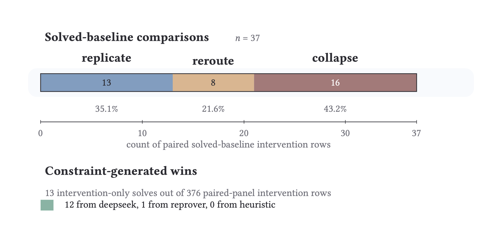
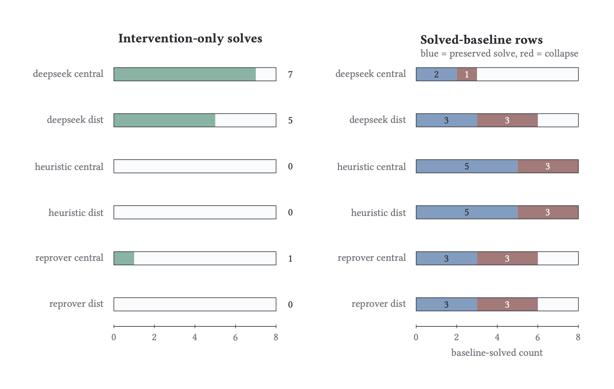
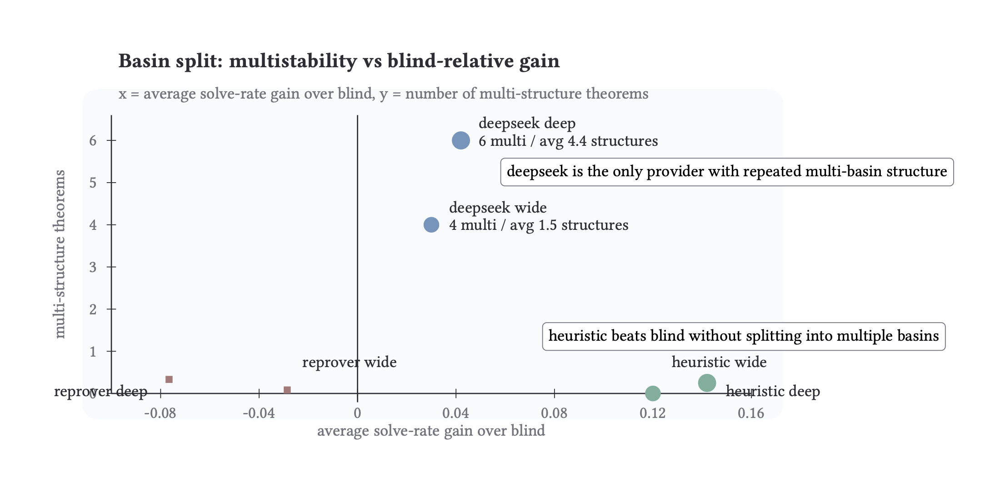

# Wonton Soup Follow-Up

The follow-up splits into smaller pieces: provider differences, blocked-tactic responses, distributed MCTS sweeps, and the cases where a failure becomes informative once we perturb the prover.

Three figures anchor the current draft:

## What the lake shows

The lake DB holds **17,400 wild-type runs** and **19,700 intervention comparisons** with valid GED scores as of April 2026.

### Provider-level comparison

| Provider | Wild runs | Solve rate | Mean K | Intervention GED norm | Multimodal fraction |
|---|---:|---:|---:|---:|
| reprover | 9,296 | 0.32 | -0.10 | 0.224 | 0.01 |
| deepseek | 3,874 | 0.30 | -0.08 | 0.442 | 0.06 |

reprover and deepseek have similar solve rates (32% vs 30%) and similar negative mean K—neither beats the blind baseline on average. But intervention GED norm is 2x higher for deepseek (0.442 vs 0.224): deepseek interventions are more structurally disruptive. Hash mismatch rate is low for both (4-5%), meaning proof structure is usually preserved.

Basin multistability is rare. reprover has >1 structure on 1% of theorems, deepseek on 6%. The dominant structure captures 43% of seeds for reprover, 32% for deepseek.

### Tactic-role visibility (distributed MCTS sweep)

1,354 intervention runs across 771 wild-type solves reveal which tactics are essential:

| Intervention | Runs | Solve rate |
|---|---:|---:|
| `block_left` | 43 | 1.00 |
| `block_push_neg` | 40 | 1.00 |
| `block_contrapose!` | 20 | 1.00 |
| `block_positivity` | 20 | 1.00 |
| `block_intro` | 20 | 1.00 |
| `block_tauto` | 60 | 0.67 |
| `block_constructor` | 40 | 0.50 |
| `block_exact` | 349 | 0.11 |
| `block_cases'` | 116 | 0.17 |
| `block_simpa` | 82 | 0.24 |
| `block_simp` | 201 | 0.00 |
| `block_rw` | 96 | 0.00 |
| `block_ext` | 90 | 0.00 |
| `block_cases` | 77 | 0.00 |
| `block_induction` | 25 | 0.00 |

`block_simp` and `block_rw` kill the proof entirely—non-negotiable rewrite tactics. `block_left`, `block_push_neg`, `block_contrapose!` are fully survivable: the prover finds an alternate route every time. `block_exact` at 11% is interesting: it kills most proofs but a minority survive through `assumption` or direct term discharge.

The paired intervention panel is not simply "damage search" versus "help search." Some perturbations expose an alternate successful route, some block the obvious route and collapse, and some shift tactic usage without changing terminal success. If two perturbations solve the same theorem but travel through different tactic roles, they should not be collapsed into the same outcome class too early.

## Provider Differences

The cross-provider notes mostly keep us honest. Early comparison runs looked like high structural convergence, but much of that came from trivial one-step proofs—the convergence was expected and uninformative.

The divergent multi-step examples are the ones worth keeping. One provider leans on library lemmas where another performs explicit construction; tactic overlap can be low even when both systems reach the theorem. Provider-specific basin structure becomes visible when we score interventions below the solved/failed surface.

## Sampling Broke One Failure Mode

The tactic-generation experiments exposed a simple failure mode in beam search. Repetitive beams often generated many surface variants of the same broken tactic family.

Temperature sampling changed that surface:

| Metric | Beam Search | Sampling 1x | Sampling 3x |
|---|---:|---:|---:|
| Correct base tactic found | 4/6 | 5/6 | 5/6 |
| Average unique base tactics | 2.7 | 4.2 | 4.7 |

Diversity itself is an intervention variable. When a prover is trapped in repeated malformed tactic families, sampling can expose alternate base tactics that beam search fails to surface.

DeepSeek-style generation gave a different tradeoff. It had better tactic quality on a small panel, much slower inference, and a larger runtime footprint. That makes it attractive as a fallback or diagnostic provider, not obviously as the main MCTS provider.

## Distributed MCTS Sweep

The distributed MCTS sweep adds a wrinkle. Wild-type solves stayed stable across scenarios, while intervention counts changed under block and delay settings.

Seed0 summary:

| Scenario | Wild solved | Interventions solved | Total interventions |
|---|---:|---:|---:|
| baseline | 24/40 | 29/85 | 85 |
| damage-block-f0.1 | 24/40 | 29/85 | 85 |
| damage-block-f0.3 | 24/40 | 30/88 | 88 |
| damage-block-f0.5 | 24/40 | 32/93 | 93 |
| adapt-block-f0.1 | 24/40 | 29/85 | 85 |
| adapt-block-f0.3 | 24/40 | 29/85 | 85 |
| adapt-block-f0.5 | 24/40 | 29/83 | 83 |
| damage-delay-p0.1 | 24/40 | 29/85 | 85 |
| damage-delay-p0.3 | 24/40 | 29/83 | 83 |

The damage-block-f0.5 condition added eight interventions relative to baseline. The extra interventions concentrated in four theorems, and three of the extras solved, which looks like a search-path shift rather than a broad improvement.

## Where The Signal Is

Blocking tactics is interesting when the prover reroutes. The writeup should separate terminal outcome from tactic-role structure: which tactic families become necessary or brittle, where one provider reroutes while another collapses, whether extra interventions produce solved routes or only churn.

This connects directly to the competency-motif idea—a blocked local channel is only interesting when the system reroutes through a nontrivial alternate path.

For the broader framing on cognition across heterogeneous systems, see Robert Chis-Ciure and Michael Levin, "Cognition all the way down 2.0: neuroscience beyond neurons in the diverse intelligence era," *Synthese* 206, 257 (2025), [doi:10.1007/s11229-025-05319-6](https://doi.org/10.1007/s11229-025-05319-6).
